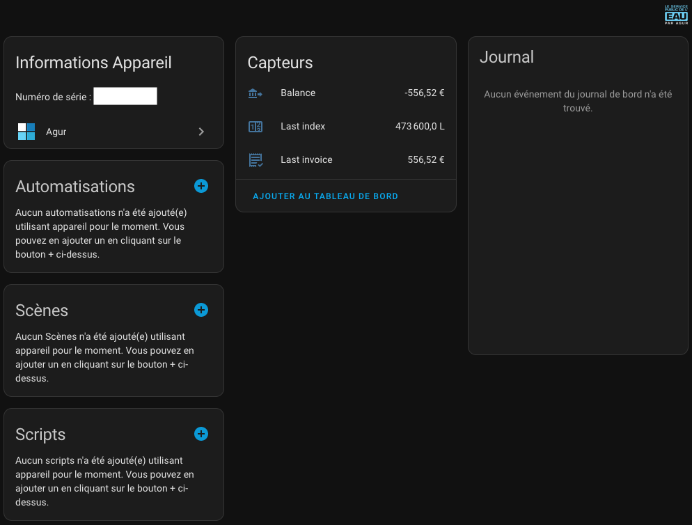

# Intégration Agur for Home Assistant

Intégration Home Assistant pour récupérer les informations de votre [compte Agur](https://ael.agur.fr) comprenant la consommation d'eau, dernière facture et balance comptable.

Voir en [English](./README.md) | Français

## Installation

### Automatique (préférée)

Ou:
- Ouvrir votre instance Home Assistant.
- Ouvrir HACS.
- Cherchez `Agur`.
- Cliquez sur le bouton `Télécharger` en bas à droite.
- Redémarrer Home Assistant.

### Manuelle

- Copiez le dossier `agur` dans le dossier `/chemin/vers/home-assistant/custom_components/`.
- Redémarrer Home Assistant.

## Configuration

Cette intégration pour Home Assistant ne supporte pas la configurationvia le ficher de configuration `configuration.yaml`
car cette méthode n'est plus recommandée par Home Assistant. Pour configurer l'intégration, veuillez vous rendre sur
Home Assistant -> Paramètres -> Appareils & Services et cliquez sur le bouton `Ajouter une intégration` dans l'onglet
`Intégrations`

Puis cliquez sur le bouton `Valider`. Vos identifiants seront validés et un nouveau écran vous sera proposé dans lequel
vous pourrez configurer plusieurs options:
- Les contrats disponibles et associés à votre compte.
- Faut-il importer les statistiques de consommation dans Home Assistant.

Ces options peuvent être modifiées à n'importe quel moment, même après avoir ajouté votre compte Agur.

## Appareil

Pour chaque contrat ajouté, un nouvel appareil est créé dans Home Assistant qui correspond au compte d'eau associé au 
contrat. Le nom par défaut est de numéro de série du compteur mais vous pouvez le changer à tout moment.

## Capteurs

Pour chaque contrat ajouté, une série de 3 capteurs est créée:

| Id                                       | Nom                                    | Description                                                                                                                         |
|------------------------------------------|----------------------------------------|-------------------------------------------------------------------------------------------------------------------------------------|
| `sensor.agur_last_index_<contract_id>`   | <meter_serial_number> Dernier index    | Le dernier index relevé de manière automatique par le compteur (en Litres)                                                          |
| `sensor.agur last_invoice_<contract_id>` | <meter_serial_number> Dernière facture | La dernière facture générée sur le contrat associé (en Euros)                                                                       |
| `sensor.agur_balance_<contract_id>`      | <meter_serial_number> Solde du         | Le solde du pour le contrat. Ce capteur peut être utile lorsque celui passe au dessus des 0€ (pour des automatisations par example) |

All 3 sensors also have attributes for easy automation consumption

| Id                    | Nom              | Description                                                                                 |
|-----------------------|------------------|---------------------------------------------------------------------------------------------|
| `date`                | Date             | La date réelle de changement de l'état du capteur                                           |
| `contract_id`         | Abonnement       | Le numéro de contract                                                                       |
| `contract_owner`      | Titulaire        | Le nom du titulaire du contrat associé                                                      |
| `contract_address`    | Adresse          | L'adresse du contrat associé                                                                |
| `meter_serial_number` | Compteur         | Le numéro de série du compteur associé                                                      |
| `invoice_number`      | Facture          | Le numéro de facture (disponible uniquement pour `sensor.agur last_invoice_<contract_id>`)  |
| `payment_date`        | Date de paiement | La date de paiement réelle (disponible uniquement pour `sensor.agur_balance_<contract_id>`) |

 

## Statistiques

Si vous avez coché l'option `Importer les statistiques pour les abonnements sélectionnés`, les données de consommation
des 3 dernières années seront alors importées dans le tableau de bord `Energie` de Home Assistant. Ces données seront
complétées avec la consommation  journalière aussi longtemps que l'intégration sera activée.

> [!NOTE]
> L'API retourne les données de consommation avec 24 ou 48 heures de délais et ces données ne sont mises à jour qu'une 
> fois par jour. Il est malheureusement impossible de récupérer des données plus détaillées.

## Langues

Cette intégration fournie des traductions pour les langues suivantes:

| Langue | Complète? |
|--------|-----------|
| EN     | :check:   |
| FR     | :check:   |