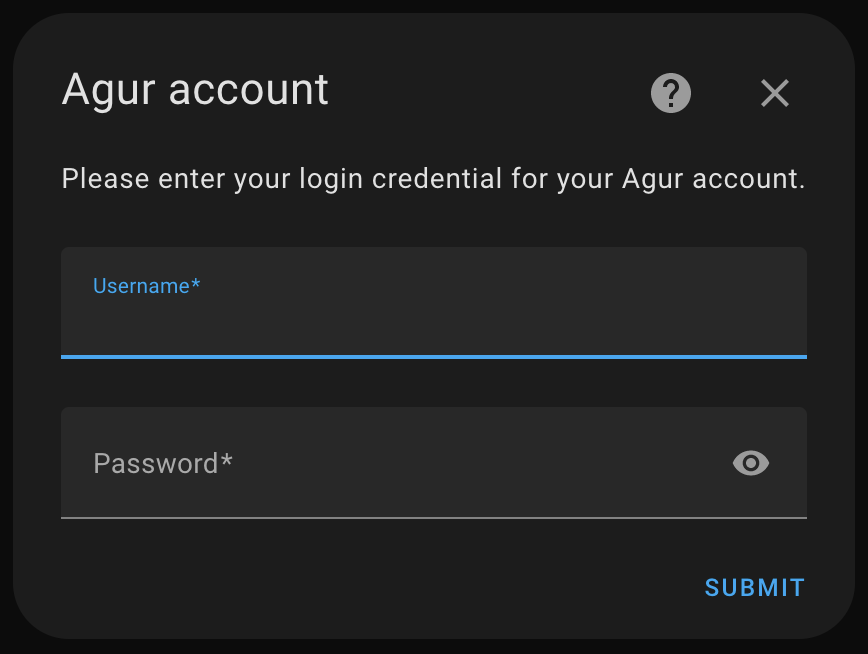
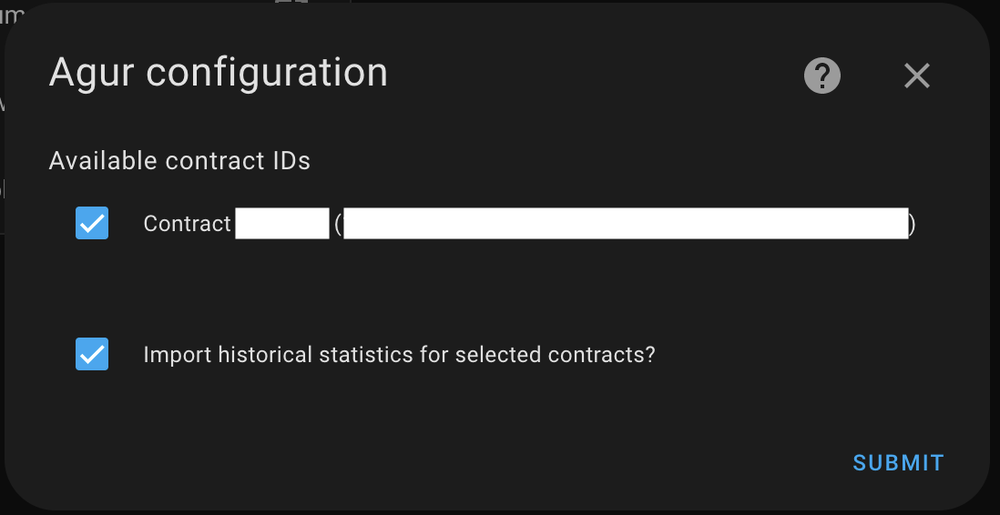
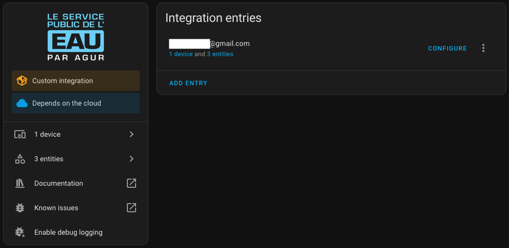
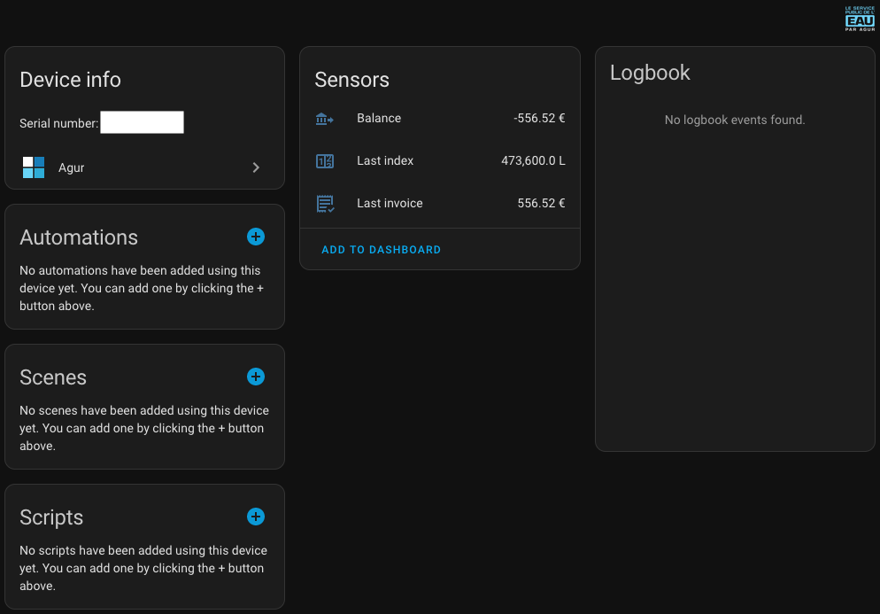

# Agur Integration for Home Assistant

Custom integration for Home Assistant to retrieve information about your [Agur account](https://ael.agur.fr) including your water consumption, latest invoice and account balance.

See in English | [Français](./README-FR.md)

## Installation

### Automatic (preferred)

Or:
- Go to your Home Assistant.
- Open HACS.
- Search for `Agur`.
- Click the `Download` button on the bottom right.
- Restart Home Assistant.

### Manual

- Copy the `agur` folder your `/path/to/home-assistant/custom_components/` directory.
- Restart the Home Assistant.

## Configuration

This custom integration does not support configuration through the `configuration.yaml` file as this is not recommended
anymore by Home Assistant. Instead, head over to Home Assistant -> Settings -> Devices & Services and on the integration
tab, click the `Add Integration` button

Then click the `Submit` button. Your credentials will be validated, and you will then be presented
with various options:
- the available contracts associated to your account that you wish to add
- whether to import statistics to Home Assistant

These options can be changed at a later time to reconfigure this the account.

## Device

For each contract added, the integration create a device corresponding to the meter. The default name used is the meter
serial number, but you can update this at your convenience.

## Sensors

For each contract added, the integration creates a set of 3 sensors

| Id                                       | Name                               | Description                                                                                                  |
|------------------------------------------|------------------------------------|--------------------------------------------------------------------------------------------------------------|
| `sensor.agur_last_index_<contract_id>`   | <meter_serial_number> Last index   | The last index retrieved for that meter (in Liters)                                                          |
| `sensor.agur last_invoice_<contract_id>` | <meter_serial_number> Last invoice | The last invoice generated for that meter (in Euros)                                                         |
| `sensor.agur_balance_<contract_id>`      | <meter_serial_number> Balance      | The accounting balance of the current contract. This sensor is useful to know if you have some amount to pay |

All 3 sensors also have attributes for easy automation consumption

| Id                    | Name                | Description                                                                                   |
|-----------------------|---------------------|-----------------------------------------------------------------------------------------------|
| `date`                | Date                | The actual date at which the state was changed                                                |
| `contract_id`         | Contract ID         | The ID of the associated contract                                                             |
| `contract_owner`      | Contract owner      | The name of the contract owner                                                                |
| `contract_address`    | Contract address    | The address for the associated contract                                                       |
| `meter_serial_number` | Meter serial number | The serial number of the associated meter                                                     |
| `invoice_number`      | Invoice number      | The invoice number (only for sensor `sensor.agur last_invoice_<contract_id>`)                 |
| `payment_date`        | Payment date        | The date when the last payment was made (only for sensor `sensor.agur_balance_<contract_id>`) |

 

## Statistics

If you check the option `Import historical statistics for selected contracts` then the statistics for the last 3 years
will be imported automatically into the `Energy dashboard` and will be kept up to date.

> [!NOTE]
> The API returns data up to 24 or 48 hours before the actual date, and only once a day. It's unfortunately impossible
> to get a more granular statistics

## Languages

This integration provides translations for:

| Language | Complete? |
|----------|-----------|
| EN       | :check:   |
| FR       | :check:   |